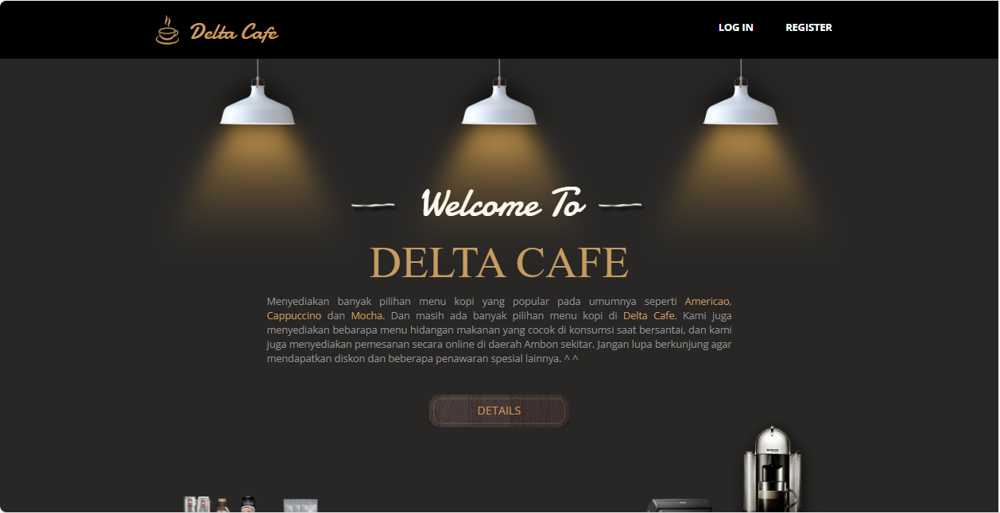
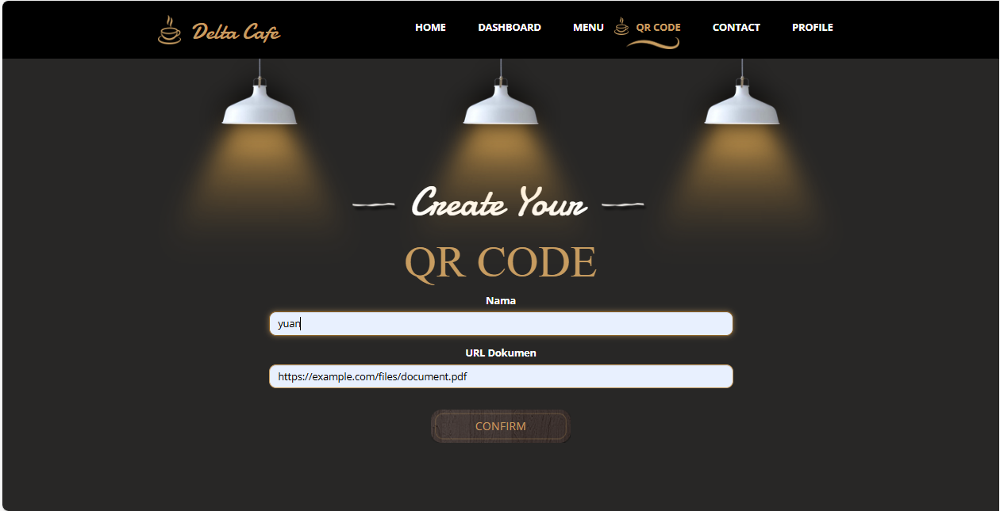
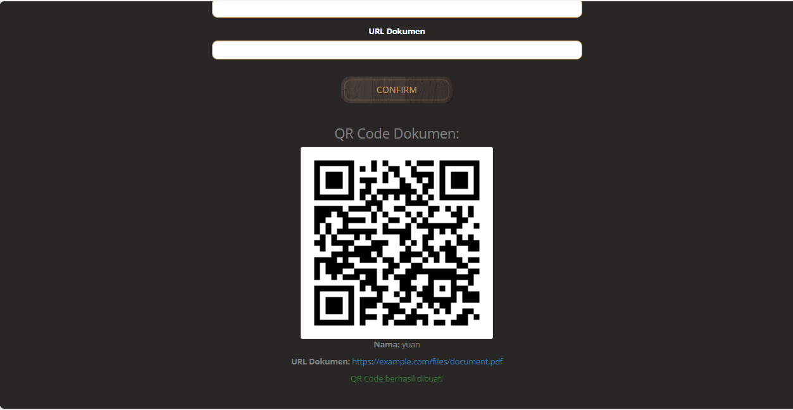

# PROJECT UAS
## Implementasi Fitur Autentikasi Menggunakan Laravel Breeze
1. Membuat Project Baru:  
   ```
   composer create-project laravel/laravel qrcode
   ```
   
2. Masuk ke File Project:
   ```
   cd qrcode
   ```
   
3. Install Laravel Breeze:
   ```
   composer require laravel/breeze --dev
   ```
   Kemudian pilih ```blade```--> Untuk proyek berbasis Blade (sederhana dan ringan) dan juga agar fokus pada autentikasi dasar.
   
4. Migrasi Database:
   Mengubah pengaturan database di file ```.env```:
   ```
   DB_CONNECTION=mysql
   DB_HOST=127.0.0.1
   DB_PORT=3306
   DB_DATABASE=qr_codes
   DB_USERNAME=root
   DB_PASSWORD=
   ```
   Perubahan:
            ```DB_CONNECTION=sqlite``` --> ```DB_CONNECTION=mysql``` Karena pada dasarnya MySQL memiliki kelebih Dukungan Penuh dan Cocok Untuk Aplikasi Besar.
            ```DB_DATABASE=Laravel``` --> ```DB_DATABASE=qr_code``` Menyesuaikan dengan nama database yang dibuat sebelumnya.
   
6. Membuat Tabel:
   Jalankan migrasi untuk membuat tabel pengguna dan tabel terkait autentikasi:
   ```
   php artisan migrate
   ```
   
7. Menjalankan Aplikasi:
   ```
   php artisan serve
   ```
   Kemudian ```Ctrl + Klik[http://127.0.0.1:8000]```
   
   Breeze akan menyiapkan rute seperti:
   - ```/register``` --> Registrasi
   - ```/login``` --> Login
   - ```/dashboard``` --> Dashboard (memerlukan autentikasi)
    
8. Contoh Code:
   Semua rute yang berkaitan dengan autentikasi berada di          ```routes/auth.php```. Ini di impor secara otomatis ke dalam Aplikasi.
   a) Code middleware pada ```routes/web.php```:
      ```
      Route::post('/login', [LoginController::class, 'store'])
        ->middleware(VerifyRecaptcha::class)
        ->name('login');

      Route::post('/register', [RegisterController::class, 'store'])
        ->middleware(VerifyRecaptcha::class)
        ->name('register');

      Route::get('/', function () {
        return view('welcome');
      });

      Route::get('/dashboard', function () {
        return view('dashboard');
      })->middleware(['auth', 'verified'])->name('dashboard');

      Route::middleware('auth')->group(function () {
        Route::get('/profile', [ProfileController::class, 'edit'])->name('profile.edit');
        Route::patch('/profile', [ProfileController::class, 'update'])->name('profile.update');
        Route::delete('/profile', [ProfileController::class, 'destroy'])->name('profile.destroy');
      });
      ```
   b) Controller untuk Dashboard:
       Membuat file app/Http/Controllers/DashboardController.php dengan perintah:
       ```
       php artisan make:controller DashboardController
       ```
      Code :
       ```
           <?php

            namespace App\Http\Controllers;
            
            use Illuminate\Http\Request;
            
            class DashboardController extends Controller
            {
                public function index()
            {
                return view('dashboard');
            }
            
            }
       ```
   c) Perbarui rute di ```routes/web.php```:
       ```
       use App\Http\Controllers\DashboardController;
       
       Route::get('/dashboard', [DashboardController::class, 'index'])->middleware('auth')->name('dashboard');
       ```
   d) Breeze secara otomatis sudah menyiap fungsi Logout.
   
10. Uji Coba Login dan Register:
   ## Register:
   
   ## Login:
   
   Saat User berhasil melakukan Register atau Login maka akan diarahkan ke halaman Dashboard:
   

   Data user akan tersimpan di database yang sudah dibuat sebelumnya, tepatnya pada Tabel ```user```.
   


## Membuat middleware di Laravel untuk mencegah serangan XSS
Link github untuk project xss-protection: https://github.com/ZhandouX/xss_protection.git

1. Membuat Projek:
   ```
   composer create-project laravel/laravel xss-protection
   ```
   
2. Masuk ke File Projek:
   ```
   cd xss-protection
   ```
   
3. Membuat Middleware untuk Mencegah XSS:
   ```
   php artisan make:middleware XSSProtection
   ```
   
4. Edit file ```app/Http/Middleware/XSSProtection.php```:
   ```
   <?php

    use Illuminate\Foundation\Application;
    use Illuminate\Foundation\Configuration\Exceptions;
    use Illuminate\Foundation\Configuration\Middleware;
    use App\Http\Middleware\XSSProtection;
    
    return Application::configure(basePath: dirname(__DIR__))
        ->withRouting(
            web: __DIR__.'/../routes/web.php',
            commands: __DIR__.'/../routes/console.php',
            health: '/up',
        )
        ->withMiddleware(function (Middleware $middleware) {
            $middleware->append(XSSProtection::class); // Tambahkan middleware di sini
        })
        ->withExceptions(function (Exceptions $exceptions) {
            //
        })->create();
   ```
   
5. Mendaftar Middleware di Kernel:
   Buka file ```app/Http/Kernel.php``` dan tambahkan middleware baru di grup ```web```:
   ```
    protected $middlewareGroups = [
        'web' => [
            // Middleware bawaan Laravel
            \App\Http\Middleware\XSSProtection::class, // Tambahkan ini
        ],
        'api' => [
            // Middleware API
        ],
    ];
   ```
   
6. Menguji Middleware:
   Buat controller untuk menguji middleware:
   ```
   php artisan make:controller XSSController
   ```

   Edit file ```app/Http/Controllers/XSSController.php```:
   ```
   <?php

    namespace App\Http\Controllers;
    
    use Illuminate\Http\Request;
    
    class XSSController extends Controller
    {
        public function store(Request $request)
        {
            return response()->json([
                'clean_input' => $request->all(),
            ]);
        }
    }
   ```

   Tambahkan rute di ```routes/web.php```:
   ```
   use App\Http\Controllers\XSSController;
    
   Route::post('/xss-test', [XSSController::class, 'store']);
   ```

   Kirim request menggunakan cuURL:
   ```
   Starting Laravel development server: http://127.0.0.1:8000
   ```

   Jika middleware XSSProtection berjalan dengan benar, akan melihat output seperti ini:
   ```
   {
      "clean_input": {
        "input": "alert('xss')"
      }
   }
   ```

## Menambahkan logo sebagai watermark pada halaman login, navbar, dan footer menggunakan Laravel Blade.
1. Siapkan file gambar yang akan dijadikan sebagai logo watermark. Kemudian file gambar diletakkan di folder ```public/images/logo.png```.
2. Kemudian masuk ke projek aplikasi yaitu ```qrcode``` diatas, dan buka file             ```resources/views/layout/navigation.blade.php```. Dan ubah code ini:
    ```
    <x-application-logo src="{{ asset('images/custom-logo.png') }}" />
    ```
    Menjadi:
    ```
    
    ```
    
   ### Hasil :
   
   
3. Lakukan hal yang sama untuk merubah logo pada footer dan otomatis akan merubah logo watermark pada halaman Login & Register:
   
   ### Hasil:
   
   


## Membuat Fitur Tanda Tangan Digital Dengan URL Menjadi Sebuah QR Code
1. Install Library ```simple-qrcode```:
   ```
   composer require simplesoftwareio/simple-qrcode
   ```
2. Menambahkan Controller pada ```app/Http/Controllers/```:
   ```
   php artisan make:controller QRCodeController
   ```
3. Membuat Model dan Migrasi Database:
   ```
   php artisan make:model Signature -m
   ```
4. Edit Migrasi ```database/migrations/2025_02_19_180020_create_qr_codes_table.php```:
   ```
        public function up()
        {
            Schema::create('qr_codes', function (Blueprint $table) {
                $table->id();
                $table->string('document_url');
                $table->string('qr_code_filename');
                $table->timestamps();
            });
        }
   ```
5. Jalankan Migrasi:
   ```
   php artisan migrate
   ```
6. Membuat route di ```routes/web.php```:
   ```
    use App\Http\Controllers\QrCodeController;

    Route::middleware('auth')->group(function () {
        Route::get('/dashboard', [DashboardController::class, 'index'])->name('dashboard');
        Route::get('/create-qrcode', [QrCodeController::class, 'createQrCodeForm'])->name('create-qrcode');
        Route::post('/store-qrcode', [QrCodeController::class, 'createQrCode'])->name('store-qrcode');
    });
   ```
7. Membuat Tampilan Form Input:
   ```
   <form method="POST" action="{{ route('store-qrcode') }}">
                    @csrf
                    <div class="mb-4">
                        <label for="document_url" class="block text-md font-semibold text-black">URL Dokumen</label>
                        <input type="url" id="document_url" name="document_url" class="mt-1 block w-full px-3 py-2 border border-gray-300 rounded-md shadow-sm focus:outline-none focus:ring-indigo-500 focus:border-indigo-500 sm:text-sm" value="{{ old('document_url', $document_url ?? '') }}" required>
                        @error('document_url')
                            <span class="text-red-500 text-sm">{{ $message }}</span>
                        @enderror
                    </div>
   <!-- Tombol Buat QR Code dan konten atau fitur lainnya -->
   ```
8. Membuat Logika di Controller:
   - ```Edit app/Http/Controllers/QrCodeController.php```:
     ```
        use App\Models\QrCode;
        use Endroid\QrCode\QrCode as EndroidQrCode;
        use Endroid\QrCode\Writer\PngWriter;
        use Illuminate\Support\Facades\Storage;
        use Illuminate\Support\Str;
        
        class QrCodeController extends Controller
        {
            public function createQrCodeForm()
            {
                return view('create_qrcode'); // Halaman untuk menginput URL dokumen
            }
        
            public function createQrCode(Request $request)
            {
                // Validasi input URL dokumen
                $request->validate([
                    'document_url' => 'required|url', // Pastikan URL valid
                ]);
            
                // Ambil URL dokumen dari form input
                $documentUrl = $request->input('document_url');
            
                // Buat instance QR Code menggunakan library Endroid
                $qrCode = new EndroidQrCode($documentUrl);
                $writer = new PngWriter();
            
                // Tentukan nama file untuk QR Code dan path penyimpanan
                $qrCodePath = 'qr_codes/' . Str::uuid() . '.png'; // Gunakan UUID untuk nama file yang unik
            
                // Menyimpan QR Code sebagai file PNG di storage
                $result = $writer->write($qrCode); // Menghasilkan QR Code dalam bentuk gambar PNG
            
                // Simpan gambar QR Code ke dalam folder storage
                Storage::disk('public')->put($qrCodePath, $result->getString()); // Menyimpan string gambar ke dalam file
            
                // Simpan data QR Code ke dalam database
                QrCode::create([
                    'document_url' => $documentUrl,
                    'qr_code_filename' => $qrCodePath,
                ]);
            
                // Redirect kembali ke halaman pembuatan QR Code dengan data QR Code untuk ditampilkan
                return redirect()->route('create-qrcode')->with([
                    'success' => 'QR Code berhasil dibuat!',
                    'qr_code_filename' => $qrCodePath, // Kirimkan nama file QR Code untuk ditampilkan
                    'document_url' => $documentUrl, // Kirimkan kembali URL dokumen yang diinput
                ]);
            }
            
        }

     ```
     
   - Tambahkan pintasan di menu Dashboard untuk menuju ke halaman Create QR Code. Edit ```resources/views/layout/Navigation.blade.php```:
     ```
     <!-- Genetate QR Code -->
                    <x-nav-link :href="route('create-qrcode')" :active="request()->routeIs('create-qrcode')">
                        {{ __('Create QR Code') }}
                    </x-nav-link>
     ```
9. Menguji Fitur:
   Input URL dokumen:
   

   Hasil:
   
10. URL akan disimpan ke database pada tabel qr_codes:
    

    Dan untuk QR Code yang dihasilkan akan tersimpan di ```storage/app/public/qr_codes/``` sebagai format .png:
    

    Fitur Generator QR Code dari sebuah URL berhasil di buat.


## Mengiplementasikan Captcha pada form login/registrasi Laravel untuk menghindari serangan bot.
1. Kunjungi Google reCAPTCHA Admin di browser
2. Pilih reCAPTCHA v2, dan pilih "I'm not robot"
3. Masukkan domain aplikasi, karena disini saya menggunakan local host maka saya memasukkan domain:
   ```localhost```
   kemudian tambahkan domain lagi, yaitu alamat lokal aplikasi Laravel saat menjalannya di browser:
   ```127.0.0.1```

4. Instalasi Paket untuk reCAPTCHA
   Saya menggunakan paket ```anhskohbo/no-captcha``` untuk mempermudah integrasi reCAPTCHA di Laravel:
   ```
   composer require anhskohbo/no-captcha
   ```
5. Konfigurasi Google reCAPTCHA
   Tambahkan ```NOCAPTCHA_SECRET``` dan ```NOCAPTCHA_SITEKEY``` di file ```.env```:
   ```
   NOCAPTCHA_SECRET=your-secret-key
   NOCAPTCHA_SITEKEY=your-site-key
   ```
6. Ubah key pada file ```.env```:
   
   ```
   NOCAPTCHA_SECRET=6Lcut9wqAAAAAHDbPDZFZZU6lKrdP1JYz3GG3Qfr
   NOCAPTCHA_SITEKEY=6Lcut9wqAAAAAPnANTQ5eJ5kjOk555XMIgJJmwTK
   ```

   Mendaftarkan konfigurasi di ```config/service.php```:
   ```
   // config/services.php
   return [
        // ...
        'recaptcha' => [
            'sitekey' => env('NOCAPTCHA_SITEKEY'),
            'secret' => env('NOCAPTCHA_SECRET'),
        ],
   ];
   ```
7. Menambahkan reCAPTCHA di Halaman Login dan Register:
   ## Login

   ```
   {!! NoCaptcha::display() !!}
    
            @error('g-recaptcha-response')
                <div class="text-red-500">{{ $message }}</div>
            @enderror
    
    
    
            <!-- Konten lainnya -->
   </form>
   {!! NoCaptcha::renderJs() !!}
   ```

   ## Register
   ```
   {!! NoCaptcha::display() !!}
    
            @error('g-recaptcha-response')
                <div class="text-red-500">{{ $message }}</div>
            @enderror
    
    
    
            <!-- Konten lainnya -->
   </form>
   {!! NoCaptcha::renderJs() !!}
   ```
8. Validasi reCAPTCHA di Controller ```app/Http/Controllers/Auth/RegisteredUserController.php```
   ```
   $request->validate([
                'name' => ['required', 'string', 'max:255'],
                'email' => ['required', 'string', 'lowercase', 'email', 'max:255', 'unique:'.User::class],
                'password' => ['required', 'confirmed', Rules\Password::defaults()],
                'g-recaptcha-response' => 'required|captcha',
            ]);
   ```

9. Uji Coba
   # LOGIN
   

   # REGISTER
   
